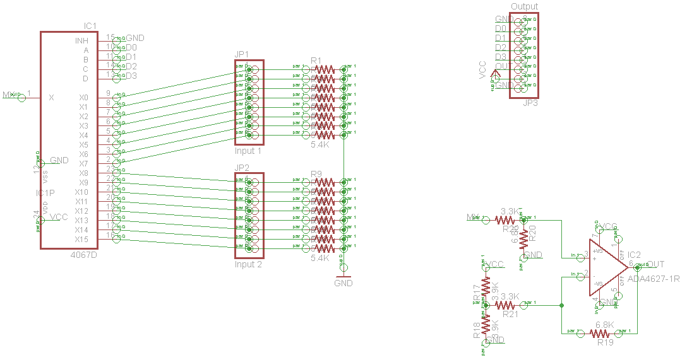
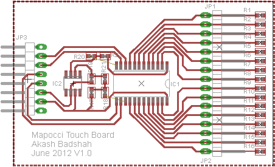

Hardware		{#hardware}
========

[TOC]

Overview 		{#hardware_overview}
--------

This is the overview of interesting hardware notes, including diagrams of the fabric sensor circuit boards as well as information on how to test the hardware to make sure it is functioning.

Fabric and Touch Sensors 	{#sensors}
--------------
The fabric and touch sensors require some extra hardware in order to interface with the arduino and be compatible with the MapocciGesture libraries. 

###Fabric Sensor Hardware	{#fabrichardware}
The fabric sensors consist of between 9 and 16 different lines which output an analog voltage to be read. This is too many analog sensors even for an Arduino Mega so we need to run these sensors through an analog multiplexer in order to read them all. In addition we must also pass the signal through an op-amp to increase the gain for human touches. 

####Board Schematic		{#schematic}
This schematic of the board shows diagramatically the important features on the board. Most noticable is the large multiplexer and the op-amp configured as a non-inverting differential amplifier.

The parts, including relevant values, are labeled on the schematic but repeated here for ease of reading.

*	IC1 = 4067D (the multiplxer and biggest box)
*	R1-R16 = 5.4KOhm (the resistors connecting sensor input to ground)
*	R17-R18 = 3.9KOhm (the vertically oriented resistors to the bottom left of the op-amp)
*	R19-R20 = 6.8KOhm (the resistor below the op-amp and the second op-amp resistor from the top)
*	R21-R22 = 3.3KOhm (the remaining two op-amp resistors)
*	IC2 = TLV071

####Board Layout			{#layout}
The layout of the board does a better job of showing how things are plugged in. On the left-hand side you have the control pins to the board. From top to bottom they are:

*	GND
*	Control 0
*	Control 1
*	Control 2
*	Control 3
*	Analog Out
*	VCC
*	GND

The pins on the right-hand side are all connected to the different sensors on the fabric. These connections can be made using ribbon cables to hook up the board to the arduino. When hooking up the pins to the arduino attach the GND and VCC cables to the power rail, Controls 0-3 to digital pins, and Analog Out to an analog pin. 

Be sure to configure the arduino code with the correct pinout. For the torso for example, set `int ConTPins[]` to an array holding the locations of Controls 0-3 in order. Then set `int FpinT` to the Analog pin used by Analog Out. Configure the stomach and bottom similarly.

###Capacitive Sensor Hardware	{#capacitive}

The hardware for capacitive sensing is extremely simple, it consists of a single resistor and a conductive element (the sensing fabric in this case). 

~~~~~~~~~~~~~~~~~~~~~~

     VCC            DOut
     ---              |
      |               |    ________
      |   820KOhm     |   |        |
      ----/\/\/\----------| Sensor |
                          |________|

~~~~~~~~~~~~~~~~~~~~~~

Testing 						{#testing}
-------

The testing procedure for hardware is fairly straightforward and methodical. Depending on your problem and goal, look through the following documentation for troubleshooting advice.

###Looking at Raw Data				{#raw_data}
If you want to see the actual values output by different sensors you should print out the values of the sensors directly before processing. The best place to do that is within GestureHandler::report(). Add `Serial.print()` statements as needed to print relevant data from the GestureHandler::rawData variable, an instance of the sensorData struct.

**Note** that the current prints being made are specifically formatted to cooperate with the Matlab visualization code, if you want to look at fabric sensor raw data I suggest using the @ref visualization instructions below.

In addition, this way of looking at the raw data is extremely hard for the fabric sensors and much more useful for things like the accelerometer, gyroscope, and capacitive sensors.

###Fabric Sensor Visualization		{#visualization}

If debugging the fabric sensors is your goal then this is the best place to start. I have included the relevant matlab script within the repository to allow you to run this script and see the visualization. *Read these directions carefully to prevent matlab from freezing*

1.	Make sure that the correct data will be printed.
	1.	Start by assuring that all printing of sensor data is commented out or supressed
	2.	Proceed to GestureHandler:report() and either add or uncomment code that will print the data in GestureHandler::oldTorso[], GestureHandler::oldBottom[], and GestureHandler::oldStomach[].
	3.	This should print each data sequentially on the the same line, seperated by tabs. Finally add a new line to seperate each cycle by a newline. You can do this by copying the following code to the end of the GestureHandler::report() method

			for(int i=0; i<16; i++)
			{
				Serial.print(rawData.torso[i]);
				Serial.print('\t');
			}
			for(int i=0; i<9; i++)
			{
				Serial.print(rawData.bottom[i]);
				Serial.print('\t');
			}
			for(int i=0; i<14; i++)
			{
				Serial.print(rawData.stomach[i]);
				Serial.print('\t');
			}
			Serial.println("");
			
2.	Startup Matlab and the Visualization
	1.	Start matlab and create a variable to hold the serial port

			s = serial('COM_PORT_NAME', 'BaudRate', 9600);

	2.	Open the serial port and *immediately* run the visualization

			fopen(s);
			data = MapocciVisualization(s)

	3.	Your screen should now have the visualization on it, it shows the value of each sensor as a stem plot. *You will not be able to interact with the chart because it is live*
3.	Closing the visualization
	1.	*This is the critical step to prevent Matlab from freezing*. End the visualization by clicking on the visualization window and pressing **CTRL-C**
	2.	Then proceed to the Matlab commandline and wait for a ">" indicating you can type. Close the serial port to prevent data overflow.

			fclose(s);

There are several ways to extend this visualization to account for different purposes. The main extension would be to see a less processed version of the sensor data. The best way to do this is to go to the appropriate SensorHandler method and set the fabricScaleFactor to 0. Then modify SensorHandler::removeDeadPixels() to simply `return data[index]`.

Further modifications to the Matlab script may be needed in order to show the appropriate range. Changing both occurences of the `axis` command to have a higher final value should increase the vertical scale of the graph.

The matlab code in full is included here:

	function data = mapocciVisualization(s)
	    figure;
	    axis([0 40 0 200]);
	    while true
	        line = fgetl(s);
	        nums = regexp(line, '\t','split');
	        data = str2double(nums);
	        clf;
	        stem(data);
	        axis([0 40 0 200]);
	        drawnow;
	    en
	end

###Looking at Gesture Output			{#gesture_output}
If all you want to do is look at the gesture output, you should go to the arduino sketch you are running these libraries from. An example sketch is shown on the [Main Page](@ref index). In this sketch you would want to add the final line in order to see the print out of the gestures.

	Serial.println(gestures);

Or if you prefer to only print positive identifications:

	if(gestures!="") Serial.println(gestures);

Looking at this output can give you a sense of what would activate a gesture on the Mapocci and help in the adjustment of thresholds to fine tune gesture responsiveness. If the behavior seems entirely erratic see @ref gesture_algorithm on the algorithms page to see how to debug the algorithm itself.

###False Positives and Negatives 		{#false}
This is always an issue within a gesture recognition system and these kinds of problems will likely be the vast majority of errors. Thankfully this is the easiest thing to debug and fix with just a few different techniques which are outlined here. 

The first thing to do when dealing with false positives and negatives is to go to Gesture::proccess() and comment out the gesture(s) that are giving you problems. Test the system after this comment and ensure that all of the other gestures are still functional. This will ensure that it really is only an issue within the specific gesture and not a larger memory issue which may need to be addressed by @ref gesture_algorithm.

Once you are sure it is really a matter of false positives and negatives (most likely) you want to make sure that the hardware is functional. If you are dealing with a gesture related to the capacitive sensors see the known @ref #cap_issues for the easy way of debugging this. In general the way to test is by @ref raw_data. Go to GestureHandler::report() and add print statements for the raw data in question, make sure to supress all other prints to prevent confusion. If things are abnormal that likely means something is disconnected, dig into the Mapocci and take a look for disconnected cables!

If things seem normal, the next step is threshold adjustment. All of the thresholds can be found in GestureHandler::GestureHandler() where they are declared. For all touch related gestures increasing the thresholds will result in less false positives but potentially more false negatives.Other gestures may have different relations but it should be fairly easy to tell by looking at the code. You can adjust the gestures via a guess and check method or by @ref raw_data and seeing the values directly.

If this still doesn't work that means there is a deeper software issue which requires further investigation.

###Known Hardware Issues			{#issues}
This is a list of known hardware issues and non-permanent solutions that have been figured out to work around them. Of special note are the known hardware issues with the fabric sensors, which should be taken into account when designing future Mapoccis and sensing networks.

####Shorting between GND and VCC		{#shorting}
	If the Mapocci is running but frequently seems to disconnect from the computer even when the cable is plugged in, the arduino has probably reset because there is a short. The arduino has very good circuitry to save itself in the case of a short so you shouldn't worry if this happens occasionally. What probably happened was that one of the exposed pins on external hardware touched the base of the arduino or another ground area. Try to isolate "live" wires as much as possible by cutting long leads and securing things into place. If this does happen disconnect and recconect the arduino (it might take a few times) in order to get it reconnected to the computer.

####Fabric Sensor Noise			{#fab_noise}
	If you are looking at the data or visualization from the fabric sensor and you periodically see one of the wires jump to a high voltage there is likely one of a couple different kinds of disconnections. The op-amp will do this when it sees a 0 on the sensor wire so these spikes mean something is disconnected. If all of the sensors on a fabric are high it probably means the VCC is disconnected. Otherwise it probably means the hard soft joint of the sensor in question is too weak. The best way to prevent against this happening is to provide strain relief for the hard soft connections and make sure that they are sewn down well so they cannot move very much.

####Capacitive Sensor Issues 	{#cap_issues}
	Although the capacitive sensors are quite robust (especially their signal to noise ratio), there is one very common issue and being able
	to recognize it will save a lot of trouble. If you are seeing a lot of @ref false for the touch gestures it is likely a problem with a capacitive sensor. If you are @ref raw_data and find that a capacitive sensor is giving the value of **16000** that means the **sensor is disconnected**! It may either be unplugged or have physically disconnected from the arduino or the power supply.
